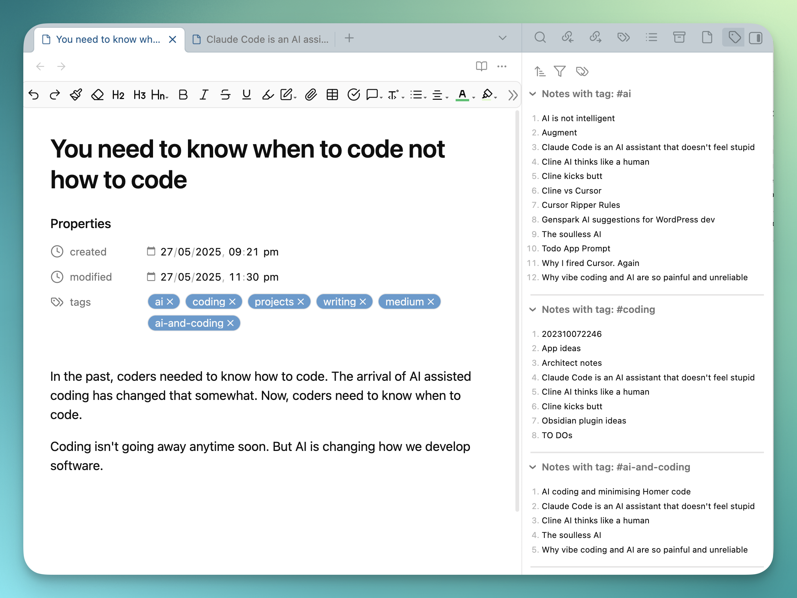

# Related Notes by Tag

Discover related content in your Obsidian vault through tag-based connections. This plugin displays notes that share tags with your currently active note, helping you find related notes and build stronger knowledge connections. For note takers using generic titles, like Zettelkasten and atomic notes, use its excerpts feature.

If you're a heavy tag user, this plugin makes tags even more useful.

## Features

* **Tag-based Matching**: Finds notes that share one or more tags with your current note
* **Automatic Discovery**: Instantly shows related notes when you open any tagged note
* **Sidebar Integration**: Clean, unobtrusive sidebar panel that fits seamlessly into your Obsidian workflow
* **Real-time Updates**: Automatically refreshes when you switch between notes
* **Flexible Sorting**: Sort related notes by name, modified date, or creation date
* **Tag Group Sorting**: Order the tag groups themselves by tag name (A-Z) or by how many notes each contains
* **Tag Filtering**: Set minimum tag match requirements (1, 2, or 3+ matching tags)
* **Show All Notes**: Choose no filter to list every tagged note in your vault, not just those matching the current note
* **Matched Tags Display**: Option to show which tags are shared between notes
* **Titles and Excerpts**: Show a note's title, a content excerpt, or both — ideal for Zettelkasten or atomic notes with generic, date-based titles
* **Collapsible Groups**: Organize results by tag with expandable/collapsible sections
* **Tag or Title View**: Toggle between notes grouped under each matching tag, and a single flat list by title where each note appears once with a count of the tags it matched
* **Folder Exclusion**: Exclude files from specific folders
* **Search Notes**: Filter the listed notes by word or `#tag`, matching note titles and full note content, with a choice of matching any or all of your search terms. Prefix a term with `-` to exclude notes matching it

## Installation

### From Obsidian Community Plugins

1. Open Obsidian Settings
2. Go to Community Plugins
3. Search for "Related Notes by Tag"
4. Click Install, then Enable

### Manual Installation

1. Download the latest release from GitHub
2. Extract to your vault's `.obsidian/plugins/related-notes-by-tag/` folder
3. Enable the plugin in Obsidian Settings > Community Plugins

## How to Use

1. **Find the Panel**: After installation, the Related Notes by Tag panel automatically appears in your right sidebar (but stays closed)
2. **Open the Panel**: Click on the "Related Notes by Tag" tab in the right sidebar, or use the command palette ("Related Notes by Tag: Open sidebar")
3. **Browse Related Notes**: The panel will automatically show notes related to your active note
4. **Customize Display**: The toolbar's dropdowns sort notes, filter by tag match count, and sort the tag groups; its buttons switch between tag and title views, show matched tags, and expand or collapse all groups. Tag group sorting and expand/collapse are unavailable in title view, which has no groups
5. **Expand and Collapse**: In tag view, click a tag group header to expand or collapse that group
6. **Search**: Use the search field below the toolbar to narrow the listed notes. Type words to match note titles and content, or `#tag` terms to match tags, and prefix a term with `-` to exclude matching notes (`-draft`, `-#archive`); the icon beside the field chooses whether notes must match any or all of your terms
7. **Quick Navigation**: Click any note title to open it immediately
8. **Modifier Support**: Cmd/Ctrl+click to open notes in new tabs
9. **Preview Support**: Hover with Cmd/Ctrl held to preview note content

## USAGE TIP
If you're finding a tag for a note has too many notes below it, try switching the filter to *2 matches* or *3 matches*. Also, try adding more tags to your current note

## Settings

Access plugin settings through Obsidian Settings > Plugin Options > Related Notes by Tag:

### General Settings
* **Default Sort Mode**: Choose how related notes are sorted by default
* **Excluded Tags**: Specify tags to ignore when finding related notes (# prefix optional)
* **Default Group State**: Set whether tag groups start collapsed or expanded
* **Show Notes in All Matching Tag Groups**: Turn off to list each note once only, under its first matching tag group, with a count of the tags it matched

### Titles and Excerpts
* **Note Display Mode**: Show the title, an excerpt of the note's content, or both
* **Excerpt Length**: Set how much content to show, measured in sentences, words, or characters
* **Include Heading**: Optionally include a note's leading heading as part of the excerpt
* **Plain Text Excerpts**: Markdown formatting, links, and tags are automatically stripped so excerpts read as plain text
* **Title Colour**: Set a custom colour for the note title/excerpt link, with a reset button to return to your theme's default
* **Title Font Size**: Set a custom font size in pixels, with a reset button to return to your theme's default
* **Title Font Weight**: Choose Normal, Medium, Semibold, or Bold, or leave at Default for your theme's usual weight

### Folder Exclusion
* **Exclude Specific Folders**: Add multiple folder paths to exclude from related notes
* **Autocomplete Support**: Type folder paths with intelligent autocomplete suggestions
* **Include Subfolders Toggle**: Choose whether to exclude just the folder or include all subfolders
* **Dynamic Descriptions**: Real-time preview of what will be excluded as you configure settings
* **Easy Management**: Add folders with one click, delete with intuitive trash icon

## Requirements

* Minimum verified on Obsidian v1.9.x
* Notes with tags (hashtags or YAML frontmatter)

> **Note**: Version 0.7.0 is the last release supporting Obsidian below v1.13.0. Later releases require Obsidian v1.13.0 or newer, so the plugin can adopt Obsidian's current settings API. If you stay on an older Obsidian, you will keep being offered 0.7.0 and the plugin will continue to work.

## Support

Found a bug or have a feature request? Please open an issue on [GitHub](https://github.com/chrishoward-projects/related-notes-by-tag).

## Also by me

* [Source Mode Styling](https://community.obsidian.md/plugins/sourcemode-styling)

***

**Author**: Chris Howard ([Obsidian author page](https://community.obsidian.md/users/chrishoward-projects))

