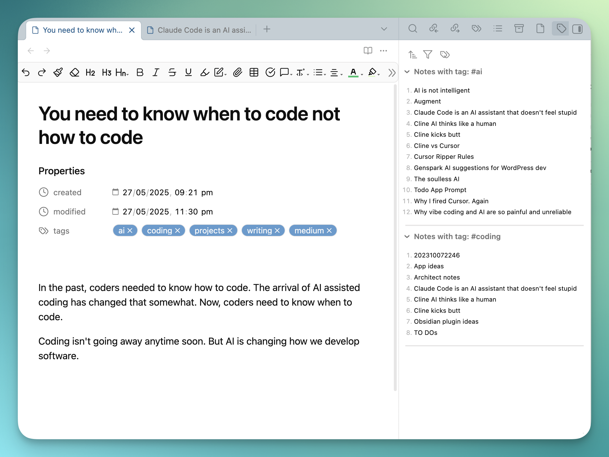

# Related Notes by Tag

Discover related content in your Obsidian vault through tag-based connections. This plugin displays notes that share tags with your currently active note, helping you find related notes and build stronger knowledge connections.

If you're a heavy tag user, this plugin makes tags even more useful.

## Features

* **Automatic Discovery**: Instantly shows related notes when you open any tagged note
* **Sidebar Integration**: Clean, unobtrusive sidebar panel that fits seamlessly into your Obsidian workflow
* **Real-time Updates**: Automatically refreshes when you switch between notes
* **Tag-based Matching**: Finds notes that share one or more tags with your current note
* **Flexible Sorting**: Sort related notes by name, modified date, or creation date
* **Tag Filtering**: Set minimum tag match requirements (1, 2, or 3+ matching tags)
* **Matched Tags Display**: Toggle to show which specific tags are shared between notes
* **Collapsible Groups**: Organize results by tag with expandable/collapsible sections
* **Folder Exclusion**: Exclude files from specific folders with granular control over subfolders

## Installation

### From Obsidian Community Plugins

1. Open Obsidian Settings
2. Go to Community Plugins
3. Search for "Related Notes by Tag"
4. Click Install, then Enable

### Manual Installation

1. Download the latest release from GitHub
2. Extract to your vault's `.obsidian/plugins/related-notes-by-tag/` folder
3. Enable the plugin in Obsidian Settings > Community Plugins

## How to Use

1. **Find the Panel**: After installation, the Related Notes by Tag panel automatically appears in your right sidebar (but stays closed)
2. **Open the Panel**: Click on the "Related Notes by Tag" tab in the right sidebar, or use the command palette ("Open Related Notes by Tag sidebar")
3. **Browse Related Notes**: The panel will automatically show notes related to your active note
4. **Customize Display**: Use the controls to sort, filter, and toggle tag visibility
5. **Navigate**: Click note titles to open them, or use modifier keys for new tabs
6. **Quick Navigation**: Click any note title to open it immediately
7. **Modifier Support**: Cmd/Ctrl+click to open notes in new tabs
8. **Preview Support**: Hover with Cmd/Ctrl held to preview note content

## USAGE TIP
If you're finding a tag for a note has too many notes below it, try switching the filter to *2 matches* or *3 matches*. Also, try adding more tags to your current note

## Settings

Access plugin settings through Obsidian Settings > Plugin Options > Related Notes by Tag:

### General Settings
* **Default Sort Mode**: Choose how related notes are sorted by default
* **Excluded Tags**: Specify tags to ignore when finding related notes (# prefix optional)
* **Default Group State**: Set whether tag groups start collapsed or expanded

### Folder Exclusion
* **Exclude Specific Folders**: Add multiple folder paths to exclude from related notes
* **Autocomplete Support**: Type folder paths with intelligent autocomplete suggestions
* **Include Subfolders Toggle**: Choose whether to exclude just the folder or include all subfolders
* **Dynamic Descriptions**: Real-time preview of what will be excluded as you configure settings
* **Easy Management**: Add folders with one click, delete with intuitive trash icon

## Requirements

* Minimum verified on Obsidian v1.9.x
* Notes with tags (hashtags or YAML frontmatter)

## Support

Found a bug or have a feature request? Please open an issue on [GitHub](https://github.com/chrishoward/related-notes-by-tag).

***

**Author**: Chris Howard ([GitHub](https://github.com/chrishoward-projects))

